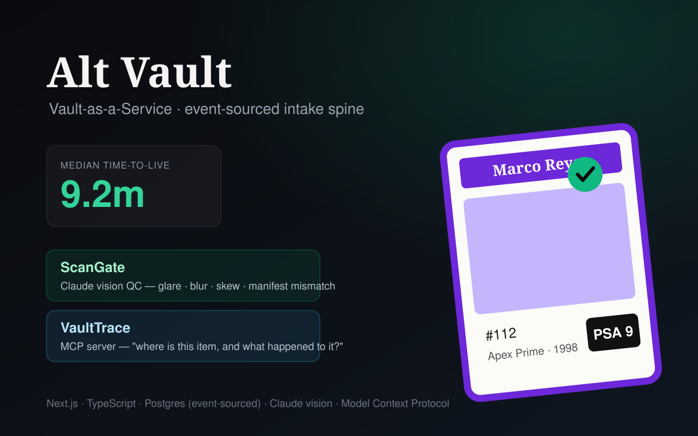

# Alt Vault — intake spine



An event-sourced vault pipeline for a physical-asset marketplace (trading cards,
sealed wax, watches). The whole system is organized around one metric — **time
from item received to live on platform** — and two named artifacts sit on a
shared, append-only event log:

- **ScanGate** — a **Claude vision** quality-control gate on the imaging line. It
  inspects each scan against the item's manifest and fails it for glare,
  misalignment, blur, or a **label that doesn't match the manifest** (the
  highest-severity defect — that's someone's asset being mis-recorded). Bad scans
  route to an exception queue *before* the item goes live.
- **VaultTrace** — a **Model Context Protocol (MCP) server** over the inventory
  and event history, so *"where is this item and what happened to it"* is one
  sentence, not a one-off query. Read-only; runs live inside Claude Code / Cursor.

> Built as a portfolio demo. It deliberately mirrors two of the "how you'll use
> AI here" prompts from Alt's founding-engineer Vault role — the vision-QC line
> and the MCP inventory server — as working software rather than talking points.

## The core idea: event sourcing

Every state change is an **appended event**, never an in-place mutation:

```
received ─▶ scanned ─▶ qc_passed ─▶ went_live          (live, sellable)
                    └─▶ qc_failed                        (exception queue)
                                   └─(operator override)─▶ went_live
```

`events` is the source of truth. `items` is a derived read model (CQRS
projection) updated in the same transaction, so dashboard and API reads stay
trivial while the log stays authoritative. The time-to-live metric, the pass
rate, and VaultTrace's chain-of-custody all fall out of that one log.

## Stack

Next.js 16 (App Router) · TypeScript · Postgres (event-sourced) · Claude vision
(`@anthropic-ai/sdk`) · Model Context Protocol (`@modelcontextprotocol/sdk`) ·
`sharp` for synthetic scan generation. Everything runs on free/local tooling.

## Run it

```bash
cp .env.example .env.local        # defaults point at the docker Postgres
npm install
npm run db:up                     # Postgres in docker (host port 5434)
npm run migrate                   # apply db/schema.sql
npm run seed:mock                 # seed 14 items — $0, no API calls
npm run dev                       # http://localhost:3000
```

`seed:mock` runs the pipeline end-to-end with a **mock gate** (verdicts derived
from scripted defects) so the dashboard, metric, exception queue, and MCP server
are fully demoable for **$0**. The dashboard's **Simulate intake** buttons push
fresh items through the same gate live.

### Flip on the real Claude vision gate

```bash
export ANTHROPIC_API_KEY=sk-ant-...   # or: ant auth login
npm run seed                          # same pipeline, real ScanGate verdicts
```

ScanGate then sends each scan to Claude (`claude-opus-5` by default; set
`QC_MODEL=claude-sonnet-5` or `claude-haiku-4-5` to cut per-scan cost) and parses
a structured verdict. Same code path, no other changes.

## VaultTrace (MCP)

```bash
npm run mcp        # stdio server exposing where_is_item, item_history,
                   # list_exceptions, vault_stats
```

Wire it into Claude Code (`.mcp.json` / client config):

```json
{
  "mcpServers": {
    "vaulttrace": {
      "command": "npx",
      "args": ["tsx", "mcp/server.ts"],
      "cwd": "/absolute/path/to/alt.vault"
    }
  }
}
```

Then ask, in plain English: *"where is TC-0005?"*, *"what's in the exception
queue?"*, *"show the chain of custody for Bennett Crowe."*

```
where_is_item("Bennett")
  → Bennett Crowe (TC-0009) is held in the QC exception queue (not live).
    Last ScanGate verdict: FAIL — Card is rotated and off-center in the frame.
```

## Layout

| Path | What |
|---|---|
| `db/schema.sql` | event log + item projection |
| `src/lib/repo.ts` | event append + projection + metrics (the domain core) |
| `src/lib/scangate.ts` | Claude vision QC gate (real + `SCANGATE_MOCK` path) |
| `src/lib/cards.ts` | synthetic scan generation + scripted defects (`sharp`) |
| `src/app/api/*` | items, metrics, intake, override |
| `src/app/page.tsx` | the dashboard |
| `mcp/server.ts` | VaultTrace MCP server |
| `scripts/seed.ts` | seed the pipeline |

## Notes & tradeoffs

- The mock gate exists so the system is provable at $0; the real integration is
  the same function with the mock branch off.
- Backdated seed timestamps give the time-to-live metric a realistic spread.
- Local scans are written to `public/scans/` (git-ignored, regenerated by seed).
  A hosted deploy would move image storage to object storage and Postgres to a
  managed instance — deliberately left as the next step.
